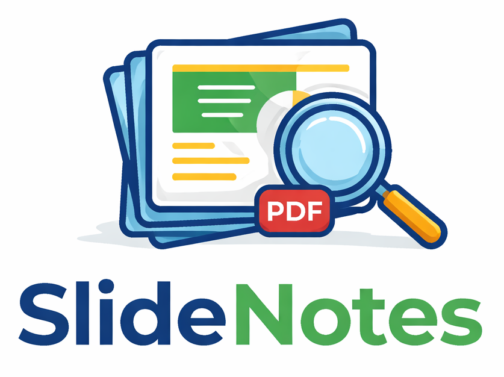

# SlideNotes — Screenshot to PDF Chrome Extension

> Capture lecture slides one by one and export them as a clean, organized PDF — without leaving your browser.



---

## Features

- **One-click capture** — screenshots the active tab instantly
- **Page Manager** — reorder, move, or delete slides before exporting
- **Export PDF** — all slides compiled into a single PDF file
- **Keyboard shortcuts** — work without opening the popup
- **Right-click context menu** — capture or export from the toolbar icon
- **Persistent storage** — slides are saved even if you close the popup
- **Drag & drop reorder** — rearrange slides in the editor

---

## Installation (Chrome / Edge)

### Load Unpacked (Free, Personal Use)

1. Download or clone this repository
2. Open Chrome → `chrome://extensions/` (or Edge → `edge://extensions/`)
3. Enable **Developer mode** (top-right toggle)
4. Click **Load unpacked**
5. Select the `screenshot_pdf` folder
6. Pin the extension from the puzzle icon in the toolbar

---

## How to Use

| Step | Action                                                     |
| ---- | ---------------------------------------------------------- |
| 1    | Open your lecture/presentation tab                         |
| 2    | Click **Capture** in the popup (or press `Ctrl+Shift+X`)   |
| 3    | Repeat for each slide                                      |
| 4    | Click **Manage** to reorder or delete slides               |
| 5    | Click **Export PDF** (or press `Ctrl+Shift+Z`) to download |

---

## Keyboard Shortcuts

| Shortcut       | Action                         |
| -------------- | ------------------------------ |
| `Ctrl+Shift+X` | Capture current tab screenshot |
| `Ctrl+Shift+Z` | Export all slides as PDF       |

> You can change shortcuts at `chrome://extensions/shortcuts`

---

## Right-Click Context Menu

Right-click the SlideNotes icon in the toolbar for quick access to:

- Capture screenshot
- Export PDF

---

## Project Structure

```
screenshot_pdf/
├── manifest.json       # Extension config (Manifest V3)
├── background.js       # Service worker — shortcuts, context menu, capture
├── popup.html          # Compact toolbar popup
├── popup.js            # Popup logic
├── styles.css          # Popup styles
├── editor.html         # Full-page slide manager
├── editor.js           # Drag-drop, reorder, delete, auto-export
├── editor.css          # Editor styles
├── content.js          # Content script (minimal placeholder)
├── SlideNotes.png      # Extension logo / icon
└── lib/
    └── jspdf.umd.min.js  # jsPDF 2.5.1 (local, no CDN)
```

---

## Tech Stack

- **Manifest V3** Chrome Extension API
- **jsPDF 2.5.1** — PDF generation (local, no internet required)
- `chrome.tabs.captureVisibleTab()` — screenshot capture
- `chrome.storage.local` — persistent slide storage
- `chrome.commands` — keyboard shortcuts
- `chrome.contextMenus` — right-click actions
- Vanilla HTML / CSS / JavaScript — zero frameworks

---

## Contributing

Pull requests are welcome! Some ideas for improvements:

- Cloud sync (Google Drive / Dropbox)
- Custom PDF page size (A4, Letter)
- Annotation / drawing on slides
- Firefox support

---

## License

MIT License — free to use, modify, and distribute.

---

## Author

**Shivam Saxena** — [GitHub](https://github.com/Saxena-Shivam)
